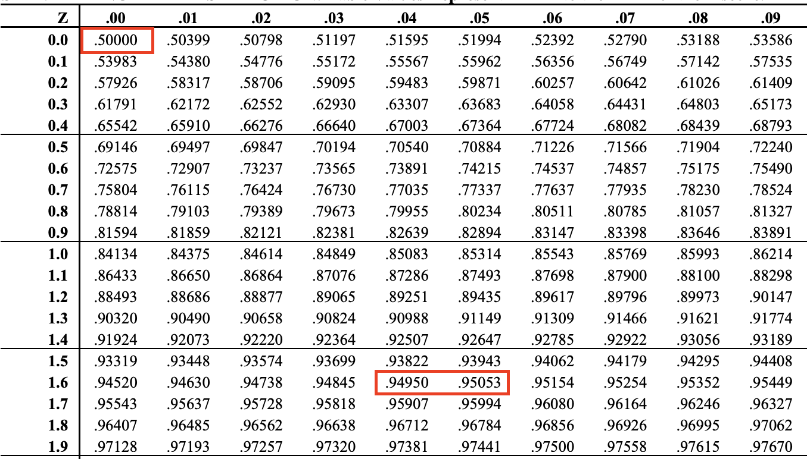

```{=html}
<style>
body {
  font-size: 17px;
  line-height: 1.6;
}
</style>
```

```{r setup, include=FALSE}
rm(list = ls())   
library(ggeffects)
library(kernlab)
library(showtext)
library(kableExtra)
library(dplyr)
library(tidyverse)
library(scales)
library(tidyverse)
```


In the previous module, we explored the fundamentals of Maximum Likelihood Estimation (MLE) and the structure of Generalized Linear Models (GLMs). We learned how MLE serves as the estimation method behind GLMs and how GLMs extend the linear regression framework to accommodate non-normal outcome variables.

In this module, we will take a deeper dive into GLMs. You’ll learn how to specify and estimate GLMs in R, how to interpret model outputs, and how to assess model fit using appropriate evaluation tools.

Part 1 begins with a brief recap of GLMs: what they are, when they are needed, and a review of their three key components—the random component, the linear predictor, and the link function. We’ll then examine the link function in more detail, highlighting how it transforms the linear predictor to fit the scale of the response variable. Part 2 focuses on the practical application of GLMs in R. We’ll estimate a model using real-world data, interpret the coefficients, and learn how to evaluate model fit using diagnostic tools and performance metrics.

By the end of this module, you will be able to:

- Clearly describe the components of a Generalized Linear Model

- Choose the appropriate GLM based on the nature of your outcome variable

- Estimate and interpret GLMs using R


## Part 1: Reviewing Generalized Linear Models (GLMs)

### Review: What Are GLMs, When Do We Need Them, and What Are Their Three Key Components?

A **Generalized Linear Model (GLM)** is an extension of the linear regression framework that allows us to model outcome variables that are not continuous or normally distributed—such as binary (e.g., yes/no), count (e.g., number of events), or proportion data (e.g., vote share). Unlike ordinary least squares (OLS), which minimizes squared errors, GLMs use **Maximum Likelihood Estimation (MLE)** to estimate parameters by finding the values that make the observed data most probable.

GLMs are particularly useful when your dependent variable violates key OLS assumptions—such as normality, constant variance, or continuity.

A GLM consists of three key components:

1. **Random Component**  

Specifies the distribution of the dependent variable (e.g., binomial for binary outcomes, Poisson for count data, normal for continuous data). This reflects the nature of your response variable.

2. **Linear Predictor**  

A linear combination of the explanatory variables, expressed as:

$$
\eta_i = \alpha + \beta_1 X_{i1} + \beta_2 X_{i2} + \dots + \beta_k X_{ik}
$$

This is the same as in linear regression, but it models a transformed version of the outcome's mean.

3. **Link Function**  

Connects the mean of the dependent variable to the linear predictor. It ensures that predictions stay within valid bounds.

### Link Function

Let's now take a closer look at the third component of a GLM, the **link function**.

The **link function** $g(\cdot)$ defines the mathematical relationship between the **expected value of the response variable** $\mu_i = \mathbb{E}[Y_i]$ and the **linear predictor** $\eta_i$. It serves as a bridge, mapping the mean of the dependent variable (which might be constrained, such as being binary or always positive) onto a scale suitable for linear modeling.

In the previous module, we learned about some common examples of link functions used in Generalized Linear Models (GLMs):

| **Model Type**        | **Link Function** $g(\mu)$                            | **Inverse Link** $g^{-1}(\eta)$                    | **Used For…**                    |
|-----------------------|-------------------------------------------------------|----------------------------------------------------|----------------------------------|
| Linear Regression     | $g(\mu) = \mu$                                        | $\mu = \eta$                                       | Continuous, unbounded data       |
| Logistic Regression   | $g(\mu) = \log\left(\frac{\mu}{1 - \mu}\right)$      | $\mu = \frac{1}{1 + e^{-\eta}}$                    | Binary outcomes (0/1)            |
| Poisson Regression    | $g(\mu) = \log(\mu)$                                  | $\mu = e^{\eta}$                                   | Count data (0, 1, 2, …)          |
| Gamma Regression      | $g(\mu) = \log(\mu)$ or $g(\mu) = \frac{1}{\mu}$      | $\mu = e^{\eta}$ or $\mu = \frac{1}{\eta}$         | Skewed, positive data            |


To better understand the use of different link functions, we can categorize GLM models based on the type of dependent variable they are designed to model.

#### 1. Binary/Dummy Variable (0/1)

These use a **binomial distribution** for the outcome, with two main link functions:

**Logit (Logistic Regression)**:  

$$
g(\mu) = \log\left(\frac{\mu}{1 - \mu}\right)
$$
Here, $\mu$ is the probability that a specific event occurs (e.g., the probability of war breaking out). This function transforms the probability $\mu$ into **log-odds**.

If the probability of an event occurring is 0.8, then:

$$
\log\left(\frac{0.8}{0.2}\right) = \log(4) \approx 1.386
$$

This means that the event is 4 times more likely to occur than not.

The **inverse link function** converts log-odds back into a probability:

$$
\mu = \frac{1}{1 + e^{-\eta}}
$$

**Probit**:  

The **probit model** uses the standard normal cumulative distribution function (CDF) as its link function:

$$
g(\mu_i) = \Phi^{-1}(\mu_i) = \eta_i
$$

Here:

$\Phi(\cdot)$ is the CDF of the standard normal distribution. The function $\Phi^{-1}$ gives the **z-score** corresponding to a probability $\mu$.

**For example**:

```{r, echo=FALSE, fig.align='center', out.width='60%'}

```

- $\Phi^{-1}(0.5) = 0$: A 50% probability corresponds to a z-score of 0.

- $\Phi^{-1}(0.95) \approx 1.645$: A 95% probability corresponds to a z-score of 1.645

$\Phi^{-1}(\mu_i)$ converts a probability into a **z-score**, which is a position on the standard normal curve.

The **inverse link function** gives the predicted probability as:

$$
\mu_i = \Phi(\eta_i)
$$

#### 2. Categorical Variable (Multinomial Outcomes)

When the dependent variable takes on more than two categories, we extend binary models to **multinomial regression**. Common choices include:

- **Multinomial Logit**: Generalization of logit for multi-class problems.

- **Multinomial Probit**: Similar, but using a multivariate normal CDF.

These models are useful when the categories are **nominal** (not ordered), such as types of regime (democracy, autocracy, hybrid) or types of government intervention.

#### 3. Count Variable (Non-negative Integers)

These use the **Poisson distribution**, which models the number of times an event occurs in a fixed interval of time or space:

$$
P(Y = x) = \frac{\lambda^x e^{-\lambda}}{x!}, \quad x = 0, 1, 2, \dots
$$

This equation tells us the probability of observing exactly x events in a given interval, assuming that:

- Events occur independently of each other,

- The average rate of occurrence is constant, and

- Two events cannot happen at exactly the same time.

Here, $\lambda$ is both the **mean** and **variance** of the distribution, which means it is the expected number of events in the interval and scales the probability based on how many events x occurred.

- $\lambda = \mathbb{E}[Y] = \text{Var}(Y)$

- As $\lambda$ increases, the distribution becomes more symmetric and spread out.

- A Poisson distribution can be approximated by a normal distribution when the $\lambda$ value is sufficiently large. 

So, for example, if $\lambda = 5$, this formula gives the probability that you’ll observe exactly 0, 1, 2, 3, … events, assuming the average number of events is 5.

```{r, fig.align='center', echo=FALSE, warning=FALSE}
library(ggplot2)
library(tidyr)

# Create data
df <- data.frame(x = 0:20)
df$lambda1 <- dpois(df$x, lambda = 1)
df$lambda5 <- dpois(df$x, lambda = 5)
df$lambda10 <- dpois(df$x, lambda = 10)

df_long <- pivot_longer(df, cols = starts_with("lambda"),
                        names_to = "lambda", values_to = "prob")

ggplot(df_long, aes(x = x, y = prob, color = lambda)) +
  geom_line(stat = "identity", position = "dodge") +
  labs(x = "Count (x)",
       y = "Probability",
       title = "Poisson Distribution with Varying λ") +
  scale_color_manual(values = c("steelblue", "darkorange", "forestgreen"),
                    labels = c("λ = 1", "λ = 5", "λ = 10")) +
  theme_minimal() +
  theme(plot.title = element_text(hjust = 0.5))
```

This plot shows how the Poisson distribution changes shape as $\lambda$ increases:

- When $\lambda = 1$: the distribution is right-skewed.

- When $\lambda = 5$: the distribution centers around 5.

- When $\lambda = 10$: the distribution becomes more symmetric and resembles a bell curve.

We model the mean $\lambda$ as a function of predictors using the **log link**:

$$
\log(\lambda_i) = \eta_i = \alpha + \beta_1 X_{i1} + \cdots + \beta_k X_{ik}
$$

This ensures that $\lambda_i > 0$, as required for count data.

## Part 2: Practical Application of GLMs

### How to Interpret the Coefficient

GLM coefficients represent the effect of a one-unit change in the predictor on the transformed (linked) scale of the outcome. Interpretation varies depending on the link function used:

**For Logit Model (Logistic Regression):**  

The coefficient $\beta$ indicates **the change in the log-odds** of the outcome for a one-unit increase in the predictor.  

The logistic model is defined as:

$$
\eta = \alpha + \beta X= \log(\text{Odds}) = \log(\frac{p}{1-p})
$$

This expression means that the linear predictor $\eta$ is the log of the odds of the outcome occurring. Taking the exponential of both sides gives the odds directly:

$$
\text{Odds} = \frac{p}{1-p} = e^{\alpha + \beta X}
$$

From here, we can compute the predicted probability of the outcome:

$$
p = \frac{e^{\alpha + \beta X}}{1+e^{\alpha + \beta X}}
$$

The coefficient $\beta$ tells us how the odds of the outcome change when the predictor increases by one unit.

Specifically:

$$
\text{Odds ratio} = e^\beta
$$
 
This means **a one-unit increase in X multiplies the odds by $e^\beta$.**

Suppose:

- $\alpha = 1$

- $\beta = 0.7$

We calculate the probability for different values of \(X\):

**When \( X = 0 \):**

$$
\eta = 1 + 0.7 \cdot 0 = 1 \\
p_0 = \frac{e^1}{1 + e^1} \approx \frac{2.718}{1 + 2.718} \approx 0.731
$$

**When \( X = 1 \):**

$$
\eta = 1 + 0.7 \cdot 1 = 1.7 \\
p_1 = \frac{e^{1.7}}{1 + e^{1.7}} \approx \frac{5.4739}{1 + 5.4739} \approx 0.845
$$

So, the probability increases from **73.1% to 84.5%** (an increase of 11.4 percentage points) when \(X\) increases from 0 to 1.

The **odds ratio** for a one-unit increase is:

$$
\frac{\text{odds at } X=1}{\text{odds at } X=0} = \frac{e^{1.7}}{e^1} = e^{0.7} \approx 2.01
$$

This means the odds of the outcome **double** when \(X\) increases by one unit.

**When \( X = 2 \):**

$$
\eta = 1 + 0.7 \cdot 2 = 2.4 \\
p_2 = \frac{e^{2.4}}{1 + e^{2.4}} \approx \frac{11.023}{1 + 11.023} \approx 0.917
$$

So the probability increases from **84.5%** to **91.7%** (an increase of 7.2 percentage points) when \(X\) increases from 1 to 2.

The odds ratio for this second one-unit increase is:

$$
\frac{\text{odds at } X=2}{\text{odds at } X=1} = \frac{e^{2.4}}{e^{1.7}} = e^{0.7} \approx 2.01
$$

This means that while the odds ratio stays the same for each one-unit increase in X, the increase in probability varies depending on the starting value of X.

### For Probit Model

In a probit model, the link function is the **inverse standard normal cumulative distribution function (CDF)**:

$$
g(\mu_i) = \Phi^{-1}(\mu_i) = \eta_i = \alpha + \beta X_i
$$

The coefficient $\beta$ represents the **change in the z-score** of the latent probability for a **one-unit increase in the predictor** $X$.

This interpretation is less intuitive than in the logit model because the coefficient does not directly represent a change in probability. Instead, it reflects how much the predicted outcome moves along the standard normal curve.

Suppose:

- $\alpha = 0$

- $\beta = 0.5$

- $X$ increases from 0 to 1

Then:

$$
\eta_0 = \alpha + \beta \cdot 0 = 0 \Rightarrow \mu_0 = \Phi(0) = 0.5 \\
\eta_1 = \alpha + \beta \cdot 1 = 0.5 \Rightarrow \mu_1 = \Phi(0.5) \approx 0.691
$$

So, the probability of the event increases from **50% to 69.1%** with a one-unit increase in $X$.

**For Poisson Model:**  

### For Poisson Model

In Poisson regression, we model **count data**, where the dependent variable takes non-negative integers (0, 1, 2, …). The model assumes:

$$
\log(\mu_i) = \eta_i = \alpha + \beta X_i
$$

where $\mu_i = E[Y_i]$ is the **expected count** for observation $i$.

The coefficient $\beta$ represents the **log change** in the expected count of the dependent variable for a one-unit increase in the predictor $X$. Exponentiating $\beta$ gives the **Incidence Rate Ratio (IRR)**:

$$
\text{IRR} = e^{\beta}
$$

The IRR tells us the **multiplicative effect** on the expected count:

- If $\text{IRR} > 1$: the expected count increases.

- If $\text{IRR} < 1$: the expected count decreases.

- If $\text{IRR} = 1$: no change in the expected count.

Suppose:

- $\alpha = 1$

- $\beta = 0.3$

We compare expected counts when $X = 0$ and $X = 1$.

**When \( X = 0 \):**

$$
\eta_0 = 1 + 0.3 \cdot 0 = 1 \\
\mu_0 = e^1 \approx 2.72
$$

**When \( X = 1 \):**

$$
\eta_1 = 1 + 0.3 \cdot 1 = 1.3 \\
\mu_1 = e^{1.3} \approx 3.67
$$

- The expected count increases from **2.72 to 3.67**, which is a **35% increase**.

- This matches the IRR:

$$
\text{IRR} = e^{0.3} \approx 1.35
$$

So, each one-unit increase in $X$ multiplies the expected count by **1.35**, or increases it by **35%**.

### Model Fit: Likelihood Ratio Tests and AIC

#### Likelihood Ratio Test (LRT)

The LRT compares the goodness-of-fit of two **nested** models—one simpler (null model) and one more complex (alternative model).

\[
LRT = -2 \log\left(\frac{L_0}{L_1}\right)
\]

Where:

- $L_0$ is the likelihood of the simpler model

- $L_1$ is the likelihood of the more complex model

- The test statistic follows a **$\chi^2$ distribution** with degrees of freedom equal to the difference in the number of parameters ($k$).

- The LRT tells us whether adding parameters significantly improves model fit.

**A higher log-likelihood indicates a better fit.**


#### Akaike Information Criterion (AIC)

The **AIC** balances model fit and complexity:

\[
AIC = -2 \log L + 2k
\]

Where:

- $\log L$ is the log-likelihood of the model

- $k$ is the number of estimated parameters

**Lower AIC values indicate a better-fitting model** that avoids overfitting. AIC is especially useful for comparing non-nested models.


### Real-World Example: V-dem dataset

#### For binary variable 

Suppose we want to examine how the level of electoral democracy affects the likelihood that a country experiences civil war. Since the dependent variable—whether a civil war occurred—is binary (1 = civil war, 0 = no civil war), we cannot use ordinary least squares (OLS), which assumes a normally distributed outcome. Instead, we turn to a Generalized Linear Model (GLM) with a binomial distribution and a logit link function.

1. Visualizing the Outcome Variable

```{r, warning=FALSE, fig.align='center'}
vdem <- read.csv("vdem.csv") %>% drop_na()
vdem %>%
  ggplot(aes(x = factor(e_civil_war))) +
  geom_bar(fill = "#275D8E") +
  geom_text(stat = "count", aes(label = ..count..), vjust = -0.3) +
  labs(x = "\nCivil War", y = "Count", title = "") +
  theme_bw()
```

2. Logistic Regression Models

Model 1: Baseline Model

```{r}
model1 <- glm(e_civil_war ~ v2x_polyarchy, family = binomial(link = "logit"), data = vdem)
```

This model includes:

- A binary dependent variable `e_civil_war` (1 = civil war, 0 = no civil war)

- A continuous explanatory variable `v2x_polyarchy` (Electoral Democracy Index)

Model 2: With Lagged Civil War

To control for temporal dependence (i.e., the likelihood that civil war this year is influenced by civil war last year), we include a lagged civil war variable.

```{r}
vdem <- vdem %>%
  group_by(country_id) %>%
  mutate(laggedcw = dplyr::lag(e_civil_war, n = 1))

model2 <- glm(e_civil_war ~ v2x_polyarchy + laggedcw, family = binomial(link = "logit"), data = vdem)
```

3. Model Output

```{r, warning=FALSE, message=FALSE}
library(stargazer)
stargazer(model1, model2, type = "text")
```

In both models, the coefficient on `v2x_polyarchy` is **strongly negative and statistically significant at the 0.01 level**, indicating that **higher levels of electoral democracy reduce the likelihood of civil war**.

In Model 1, the coefficient is $\beta = -2.459$. This means that a **one-unit increase** in the Electoral Democracy Index (EDI) **multiplies the odds** of civil war by $e^{-2.459} \approx 0.085.$ In other words, the odds of civil war decrease by about **91.5%** when EDI increases by one unit.

In Model 2, after controlling for previous civil war history (`laggedcw`), the coefficient on EDI is still negative but smaller in magnitude: $\beta = -1.682$. This implies that a one-unit increase in EDI **multiplies the odds** of civil war by $e^{-1.682} \approx 0.186,$ or reduces the odds by approximately **81.4%**.

The coefficient on `laggedcw` is large and positive ($\beta = 5.388$), and statistically significant at the 0.01 level. This means that if a country experienced a civil war last year, the odds of experiencing one again this year are $e^{5.388} \approx 219.3$ times higher. This highlights a strong temporal dependency in civil war occurrence—past conflict is a powerful predictor of future conflict.

4. Model Fit Metrics

- **Log Likelihood**: A higher (i.e., less negative) log-likelihood indicates a better model fit.  

  - Model 1: $-1,\!576.36$  

  - Model 2: $-740.24$ $\Rightarrow$ **substantially better fit**

- **AIC (Akaike Information Criterion)**: Lower AIC values indicate a better fit after penalizing model complexity.  

  - Model 1 AIC: $3,\!156.71$  

  - Model 2 AIC: $1,\!486.49$ $\Rightarrow$ **much better model fit**


```{r, fig.align='center'}
library(ggeffects)
eff1 <- ggpredict(model2, terms = "v2x_polyarchy")

plot(eff1, colors = "blue")+
  labs(title = NULL,
       x = "\nElectoral Democracy Index",
       y = "Civil War\n") +
  theme_minimal()
```

The plot visualizes the **predicted probability** of civil war occurrence across different levels of the **Electoral Democracy Index (EDI)**, holding the lagged civil war variable constant (typically at its reference or average value).

- The curve shows a **clear downward trend**: as EDI increases, the predicted probability of civil war **decreases**.

- When EDI is low (toward the left side of the x-axis), the probability of civil war is **relatively high**.

- As EDI increases to higher values (closer to 1), the probability drops sharply, approaching **zero** for highly democratic countries.

- This supports the earlier coefficient interpretation: **EDI significantly reduce the likelihood** of internal conflict.

- The plot provides an intuitive, visual confirmation that **electoral democracy acts as a protective factor** against civil war.

As we learned above, the odds ratio for this model is fixed $e^{-1.682} \approx 0.186$. However, the plot shows that for each one-unit increase in EDI, the **change in predicted probability** varies across the range of X.

This is because the **logistic model is non-linear in probability space**. While the **change in log-odds is constant** for each unit change in X, the resulting change in **probability** depends on the starting value of X.

#### For count variable

To model count data, we use the number of successful coups in a given year (`e_coups`) as our dependent variable. Since this is a count variable (non-negative integers), we use a Generalized Linear Model (GLM) with:

- Distribution: Poisson

- Link function: Log

We are interested in how the level of EDI (`v2x_polyarchy`) and GDP per capita (`e_gdppc`) affect the number of coups.

1. Visualizing the Outcome Variable

```{r, warning=FALSE, fig.align='center'}
vdem %>%
  ggplot(aes(x = e_coups)) +
  geom_bar(fill = "#275D8E", binwidth = 0.2) +
  geom_text(stat = "count", aes(label = ..count..), vjust = -0.3) +
  labs(x = "\n# of Coups", y = "Count", title = "") +
  theme_bw()
```

2. Regression Models

Model3: Baseline model, Model4: Add logged value of GDP per capita.

```{r, warning=FALSE, message=FALSE}
vdem <- vdem %>%
  mutate(loggedgdp = log(e_gdppc + 0.0001))
model3 <- glm(e_coups ~ v2x_polyarchy, family = poisson(link = "log"), data = vdem)
model4 <- glm(e_coups ~ v2x_polyarchy + loggedgdp, family = poisson(link = "log"), data = vdem)
```

3. Model Output

```{r, warning=FALSE, message=FALSE}
stargazer(model3, model4, type = "text")
```

In Model 1, the coefficient for the Electoral Democracy Index (EDI) is –5.946 and statistically significant at the 0.01 level, indicating that **a one-unit increase in EDI is associated with a decrease in the log of the expected count of coups by 5.946 units**. The corresponding Incidence Rate Ratio (IRR) is $e^{−5.946} \approx 0.0026$, meaning that the expected number of coups drops by more than **99%** for each one-unit increase in EDI. 

In Model 2, the EDI coefficient remains statistically significant but is slightly smaller in magnitude at –5.169, with an IRR of $e^{−5.169} \approx 0.0057$. This suggests that even after controlling for GDP per capita, **higher levels of democracy continue to significantly reduce the likelihood of coups**. Additionally, the coefficient for GDP per capita is –0.143, which is also statistically significant at the 0.01 level. The IRR for GDP per capita is $e^{−0.143} \approx 0.867$, indicating that a one-unit increase in GDP per capita is associated with a 13.3% decrease in the expected count of coups.

4. Model Fit

- **Log Likelihood**: Model 2 has a higher (less negative) log likelihood, indicating a better fit.

- **AIC (Akaike Information Criterion)**: Model 2 has a lower AIC, which suggests it provides a better fit while accounting for model complexity.

```{r, fig.align='center'}
eff2 <- ggpredict(model4, terms = "v2x_polyarchy")

plot(eff2, colors = "blue")+
  labs(title = NULL,
       x = "\nElectoral Democracy Index",
       y = "Predicted # of Coups\n") +
  theme_minimal()
```

The plot displays the predicted number of successful coups as a function of the Electoral Democracy Index (EDI), holding other variables constant (including GDP per capita, as included in model4).

As shown in the plot, the expected number of coups decreases sharply and non-linearly as the Electoral Democracy Index (EDI) increases. When EDI is close to 0, the predicted number of coups is relatively high—around 0.16. However, even a small increase in EDI leads to a substantial drop in the expected count. Once a moderate level of democracy is reached (EDI > 0.5), the predicted number of coups becomes very low and eventually approaches zero.

This pattern reflects the multiplicative structure of the Poisson model, where each one-unit increase in EDI reduces the expected number of coups by a fixed percentage (as determined by the incidence rate ratio, IRR). Because this effect is multiplicative, the absolute change appears smaller when the baseline expected count is already low. In other words, the percentage change remains constant across the EDI range, but the impact becomes less noticeable in high-democracy contexts. 

## Wrapping Up: What We’ve Learned

In this module, we explored how Generalized Linear Models (GLMs) extend the flexibility of regression analysis to handle a wide variety of outcome types. We began with a review of the core structure of GLMs, including their three key components: the random component (which defines the outcome distribution), the linear predictor (a combination of covariates), and the link function (which connects the linear predictor to the expected value of the outcome). We then examined commonly used GLMs—logistic, probit, and Poisson regression—and saw how the link function plays a crucial role in ensuring predicted values remain in the appropriate range.

In the applied portion of the module, we learned how to specify GLMs in R using the `glm()` function, interpret the model coefficients, and assess model fit using metrics like the Log Likelihood, AIC, and visualizations from `ggpredict()`. We saw that **GLMs are nonlinear in the scale of the outcome**. This nonlinearity arises because the **link function transforms the linear predictor**, so changes in \(X\) result in **non-uniform changes in predicted probabilities** (for logistic and probit) or **multiplicative changes in expected counts** (for Poisson).

In the next module, we will explore different types of variables and relationships, including power transformations, time dependence, clustered errors, and fixed effects. We will also introduce tools for model selection, learning how to assess whether your model is a “good” one. Before moving on, be sure to complete the problem set and quiz to reinforce what you’ve learned.

