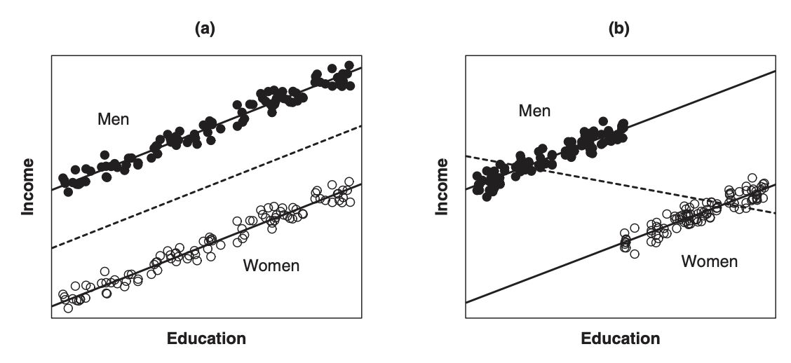

```{=html}
<style>
body {
  font-size: 17px;
  line-height: 1.6;
}
</style>
```

```{r setup, include=FALSE}
rm(list = ls())   
library(ggeffects)
library(kernlab)
library(showtext)
library(kableExtra)
library(dplyr)
library(tidyverse)
library(scales)
library(tidyverse)
library(haven)
library(stargazer)
```


In the previous module, we explored different types of variables and the nature of their relationships—linear, nonlinear, and dynamic—using tools such as variable transformations, lagged values, and fixed effects. We also discussed how to evaluate model performance using diagnostic statistics.

In this module, we focus on how variables interact with each other and how to interpret those interactions. Specifically, we will learn about dummy variables, interaction terms, and marginal effect plots. These help us model conditional relationships—where the effect of one variable depends on the value of another.

The module is divided into two parts: In part 1, we introduce dummy variables and interaction terms, discussing why and when to use them. You will learn how to implement these concepts in R and interpret the results. In part 2, We turn to marginal effects and visualization. Interaction terms are often tricky to interpret directly from coefficients; marginal effects plots provide an intuitive and accurate way to understand them.

By the end of this module, you will be able to:

- Use dummy variables to account for categorical effects in regression models.

- Construct and interpret interaction terms between continuous and/or categorical variables.

- Visualize and interpret marginal effects using plots.


## Part 1: Dummy variable and Interaction Term

### A Dummy variable

The motivation for including a categorical variable (factor) in a regression model is similar to that for adding another quantitative predictor: (1) to better explain variation in the outcome variable, thereby reducing the residual error, and (2) more importantly, to avoid biased estimates of other variables by accounting for relevant omitted factors that are correlated with them.

To illustrate this, imagine we’re studying the relationship between education and income for both men and women. In Figures (a) and (b), we see two simplified populations where the regressions of income on education are parallel within each gender. 

```{r, echo=FALSE, fig.align='center', out.width='80%'}

```

In Figure (a), gender and education are not related—men and women have similar education levels. So, if we ignore gender and just run a regression of income on education, we still get the correct slope. However, because women tend to earn less than men even when they have the same education, ignoring gender increases the size of the prediction errors.

In Figure (b), the situation is different. Gender and education are now related—women tend to have more education than men. But since women also earn less than men at the same education level, the overall regression line (ignoring gender) ends up with a negative slope. This gives us the wrong impression, even though the relationship between education and income is actually positive within each gender group.

To address this, one option is to run separate regressions for men and women. This works, but it also has downsides—it makes it harder to compare or test for gender differences. If we believe the relationship between education and income is similar for both groups (just with different intercepts), we can combine the data and use a dummy variable for gender. This allows us to estimate the common slope more efficiently while still accounting for gender differences in income.

One way of formulating the common-slope model is:

$$
Y_i = \alpha + \beta X_i + \gamma D_i + \epsilon_i
$$

where D, called a dummy-variable regressor or an indicator variable, is coded 1 for men and 0 for women:

$$
D_i = 1 \space \text{for men} \\
D_i = 0 \space \text{for women}
$$

Now let’s apply this to a real-world case using the V-Dem dataset.

We want to see how economic development (log GDP per capita) affects electoral democracy (EDI) and whether this relationship differs for countries experiencing civil war (binary: 1 = yes, 0 = no).

```{r}
vdem <- read.csv("vdem.csv") %>% drop_na() %>%
  mutate(loggedgdp = log(e_gdppc + 0.0001))

model1 <- lm(v2x_polyarchy ~ loggedgdp + e_civil_war, data = vdem)
stargazer(model1, type= "text")
```

In this regression model, `e_civil_war` is included as a dummy variable to capture the effect of civil war status on electoral democracy. The coefficient of −0.025 indicates that, on average, countries experiencing civil war have an Electoral Democracy Index (EDI) score that is 0.025 points lower than countries not in civil war, holding GDP constant. This reflects the distinct impact of being in a state of civil conflict, beyond what is explained by economic development alone.

The interpretation of the dummy variable is straightforward: it shifts the intercept of the regression line. That is, all else being equal, the expected level of electoral democracy is systematically lower for countries coded as being in civil war. This highlights how including dummy variables allows us to assess the categorical differences between groups—such as conflict vs. non-conflict countries—in a regression framework.

### What is an Interaction Term and Why Should We Consider It?

In regression analysis, we often assume that the effect of each independent variable on the dependent variable is additive and independent—meaning each variable contributes to the outcome separately, without influencing how the other variables behave. However, in many real-world situations, this assumption doesn't hold. Instead, the effect of one variable may depend on the level of another variable. This is where interaction terms come into play.

An interaction occurs when the relationship between one explanatory variable and the outcome changes depending on the value of another explanatory variable. For instance, the effect of education on income might differ between men and women. In such cases, a model that only includes main effects (e.g., education and gender separately) may miss important nuances in how variables work together to shape the outcome.

To account for this, we include an interaction term—a new variable constructed by multiplying two existing variables. This allows the slope of one variable to change depending on the value of the other. 

Mathematically, an interaction model looks like this:

$$
Y_i = \alpha + \beta_1 X_i + \beta_2 D_i + \beta_3 (X_i \cdot D_i)+ \epsilon_i
$$
 
Here:

$X_i$ is a continuous predictor,

$D_i$ is a dummy variable,

$(X_i \cdot D_i)$ is the interaction term,

$\beta_3$ tells us how the effect of $X_i$ differs when $D_i = 1$.

This model allows the slope of $X_i$ to change depending on whether the observation falls into the 0 or 1 category of the dummy variable. In other words, instead of forcing the regression lines for the two groups to be parallel (as in models without interactions), we allow them to have different slopes—better capturing the complexity of the relationship.

Now let’s see how the effect of GDP per capita on Electoral Democracy Index (EDI) differs depending on whether a country is experiencing civil war. We estimate a model that includes an interaction term between `loggedgdp` and `e_civil_war`.

```{r}
model2 <- lm(v2x_polyarchy ~ loggedgdp + e_civil_war + loggedgdp*e_civil_war, data = vdem)
stargazer(model1, model2, type= "text")
```

In Model 1 (without interaction), we see that countries experiencing civil war tend to have lower levels of electoral democracy, with a statistically significant negative effect of −0.025. However, this model assumes that the effect of GDP on democracy is the same regardless of civil war status. That is, it does not allow the relationship between economic development and electoral democracy to vary depending on whether a country is at war.

In contrast, Model 2 includes an interaction term between logged GDP per capita and civil war status, allowing the effect of GDP to differ between countries at war and at peace. The main coefficient for loggedgdp (0.192) now represents the effect of economic development on electoral democracy only in countries not experiencing civil war (when e_civil_war = 0).

The key insight comes from the interaction term: `loggedgdp:e_civil_war` = -0.106, which is negative and statistically significant. This coefficient tells us how much the effect of logged GDP changes when a country is experiencing civil war. Specifically, it means that the positive effect of GDP on electoral democracy is significantly weaker in war-affected countries.

In peaceful countries, a one-unit increase in logged GDP is associated with a 0.192-point increase in the EDI. In countries experiencing civil war, this effect is reduced by 0.106, yielding a net effect of only 0.086 (0.192 − 0.106).

Thus, the interaction term reveals an important moderation effect: while economic development generally promotes democracy, its influence is significantly blunted in the context of civil conflict.

## Part 2: Marginal Effect

### What is a Marginal Effect?

A **marginal effect** measures the expected change in the dependent variable when a specific independent variable increases by one unit, while holding all other variables constant.

In simple linear models without interaction terms, this is straightforward—the marginal effect of a variable is simply its coefficient.  

For example, in the model:

$$
Y = \alpha + \beta_1 X_1 + \beta_2 X_2 + \epsilon
$$

the marginal effect of \( X_1 \) is just \( \beta_1 \).

However, in models that include **interaction terms**, the marginal effect of a variable depends on the value of the other variable it interacts with. This is where **marginal effect plots** become especially valuable.

Suppose we estimate the following model:

$$
Y = \alpha + \beta_1 \cdot \text{GDP} + \beta_2 \cdot \text{CivilWar} + \beta_3 \cdot (\text{GDP} \times \text{CivilWar}) + \epsilon
$$

Where:

- \( \text{GDP} \) is a continuous variable,

- \( \text{CivilWar} \) is a dummy variable (0 = no war, 1 = war),

- \( \text{GDP} \times \text{CivilWar} \) is the interaction term.

Then, the **marginal effect of GDP** depends on the value of the `CivilWar` variable:

- When \( \text{CivilWar} = 0 \):

$$
\frac{\partial Y}{\partial \text{GDP}} = \beta_1
$$

- When \( \text{CivilWar} = 1 \):

$$
\frac{\partial Y}{\partial \text{GDP}} = \beta_1 + \beta_3
$$

This means the effect of GDP on democracy is **conditional** on whether the country is experiencing civil war or not.  
A single coefficient no longer captures the full relationship—you need to compute and visualize marginal effects to fully understand how the interaction behaves.

### Making Marignal Effect Plot in R

In this part, we will use the V-Dem dataset to visualize the marginal effect of GDP on EDI (Electoral Democracy Index).

#### When the interaction term is between a continuous variable and a dummy variable

We first fit a model including an interaction between logged GDP and civil war status:

```{r}
model2 <- lm(v2x_polyarchy ~ loggedgdp + e_civil_war + loggedgdp*e_civil_war, data = vdem)
stargazer(model2, type= "text")
```

In this model, the coefficient for the logged GDP is 0.192, and the coeffecient for the interaction terms is -0.106. When we draw a prediction plot for this model for each value of civil war 0 and 1:

```{r, message=FALSE}
library(sjPlot)
plot_model(
  model2,
  type = "pred",
  terms = c("loggedgdp", "e_civil_war"),
  ci.lvl = 0.95,
  robust = T,
  bpe.style = "line") +
  labs(x = "Logged GDP per Capita", y="EDI") +
  ggtitle(NULL) +
  theme(legend.justification = c(0, 0.5),
        text = element_text(size=12),
        axis.ticks.x = element_blank()) +
        scale_colour_grey(guide = guide_legend(title = "Civil War"))+
        theme_bw() +
        theme(plot.title = element_text(hjust = 0.5, face = "bold"), legend.position = c(0.1, 0.87))
```

The plot illustrates how the marginal effect of GDP on the Electoral Democracy Index (EDI) varies by civil war status. It displays two separate lines:

- One for countries not experiencing civil war (Civil War = 0)

- One for countries experiencing civil war (Civil War = 1)

The **slope** of each line reflects the strength of the relationship between GDP and democracy within each group. For countries at peace, the line is steeper, showing a stronger positive association—higher GDP corresponds to significantly higher levels of democracy. In contrast, for countries in conflict, the slope is much flatter, indicating that GDP has a weaker impact on democratic outcomes under conditions of civil war.

To better understand how the relationship between GDP and democracy differs by civil war status, we can fit the model separately for each group: one for countries not in civil war (`e_civil_war == 0`) and one for those experiencing civil war (`e_civil_war == 1`). This approach allows us to isolate the effect of GDP within each context, free from interaction terms that may be harder to interpret directly.

**For countries not in civil war:**

```{r}
civil0 <- vdem %>% filter(e_civil_war == 0)
model3 <- lm(v2x_polyarchy ~ loggedgdp * e_civil_war, data = civil0)
eff1 <- ggpredict(model3, terms = "loggedgdp")

plot(eff1, colors = "blue")+
  labs(title = NULL,
       x = "\nLogged GDP per Capita",
       y = "EDI\n") +
  theme_minimal()
```

This plot shows the predicted EDI levels as logged GDP increases, only for countries not experiencing civil war. Since civil war is fixed at 0 in this subset, the interaction term drops out, and the slope we see directly reflects the marginal effect of GDP on democracy in peaceful contexts. This plot replicates the pink-black line from the earlier interaction plot, which represented countries not in civil war. 

**For countries in civil war:**

```{r}
civil1 <- vdem %>% filter(e_civil_war == 1)
model4 <- lm(v2x_polyarchy ~ loggedgdp * e_civil_war, data = civil1)
eff2 <- ggpredict(model4, terms = "loggedgdp")

plot(eff2, colors = "blue")+
  labs(title = NULL,
       x = "\nLogged GDP per Capita",
       y = "EDI\n") +
  theme_minimal()
```

This plot now shows the predicted values of EDI only for countries in civil war. Again, since civil war is fixed at 1 in this subset, we are seeing the combined effect of both the main GDP term and the interaction. This plot mirrors the flatter blue-gray line from the earlier interaction plot, which represented countries experiencing civil war. 

#### When the interaction term is between two continuous variables

Interaction terms are not limited to dummy variables. When two continuous variables are interacted, the goal is still to model how the effect of one variable depends on the level of the other, but the relationship becomes more complex.

In our example, we are interested in whether the effect of logged GDP per capita on electoral democracy (`v2x_polyarchy`) depends on a country’s EMB capacity (`v2elembcap`). Both of these are continuous variables.

```{r}
model5 <- lm(v2x_polyarchy ~ loggedgdp * v2elembcap, data = vdem)
stargazer(model5, type = "text")
```

In this model, the coefficient for loggedgdp (0.070) tells us the estimated effect of economic development on electoral democracy when EMB capacity is at 0. This means that in countries where the EMB capacity value is 0, a one-unit increase in logged GDP per capita is associated with a 0.070-point increase in the EDI. However, the interaction term between loggedgdp and v2elembcap (0.039) indicates that the strength of this effect increases as EMB capacity improves. For every one-unit increase in EMB capacity, the effect of GDP on democracy becomes 0.039 points stronger. In other words, economic development is more strongly linked to democratic outcomes in countries with more capable and autonomous EMBs.

We can now generate predicted values of EDI for logged GDP ranging from 0 to 1, separately for EMB capacity = 0 and EMB capacity = 1:

```{r}
print(ggpredict(model5, terms = c("loggedgdp [0:1, by = 0.1]", "v2elembcap [0, 1]")), n = Inf)
```

This output shows that the gap in predicted EDI between EMB capacity = 0 and EMB capacity = 1 reflects the interaction effect (0.039).

Let’s visualize how the marginal effect of logged GDP on electoral democracy changes depending on the level of EMB capacity.

```{r, warning=FALSE, message=FALSE}
library(interplot)
interplot(model5, var1 = "loggedgdp", var2 = "v2elembcap") +
  labs(x = "EMB capacity", y = "Marginal Effect of logged GDP") +
  scale_y_continuous(breaks = seq(0, 0.5, by = 0.05)) +
  scale_x_continuous(breaks = seq(-3, 3, by = 1)) +
  theme_bw() 
```

This plot illustrates how the relationship between economic development and electoral democracy depends on EMB capacity. Each point on the x-axis represents a possible value of EMB capacity, while the y-axis shows the marginal effect of GDP at that level of capacity.

- When EMB capacity is 0, the marginal effect of GDP is approximately 0.07, which aligns with the coefficient on loggedgdp in the regression output.

- When EMB capacity increases to 1, the marginal effect of GDP rises to approximately 0.11 (0.07 + 0.039).

- When EMB capacity is -1, the marginal effect drops to around 0.031 (0.07 - 0.039). 

In sum, this graph confirms that the effect of GDP on electoral democracy is conditional: it becomes stronger as EMB capacity improves.

## Wrapping Up: What We’ve Learned

In this module, we explored how relationships between variables can change depending on the context, especially when one variable's effect depends on another.

In Part 1, we introduced dummy variables and interaction terms, showing how to include them in your models and interpret their meaning. Dummy variables allow us to account for categorical differences between groups, while interaction terms capture situations where the effect of one independent variable changes depending on the value of another.

In Part 2, we turned to marginal effects and their visualization. Marginal effects plots offer a visual way to understand how relationships vary across different levels of interacting variables. Using the V-Dem dataset, we demonstrated how to create and interpret such plots in R, both when interactions involve dummy variables and when they involve two continuous variables.

Before you move on, make sure to complete the quiz and problem set to solidify your understanding of this module. In the next module, we’ll shift our focus to inference and prediction, introducing a resampling technique: non-parametric bootstrapping.
