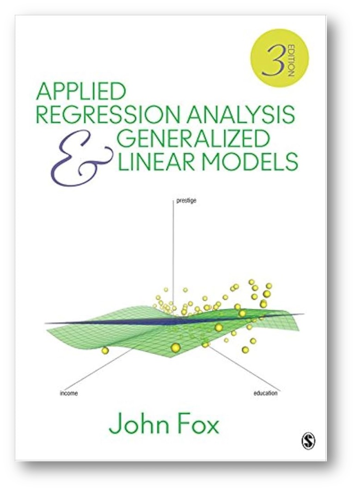
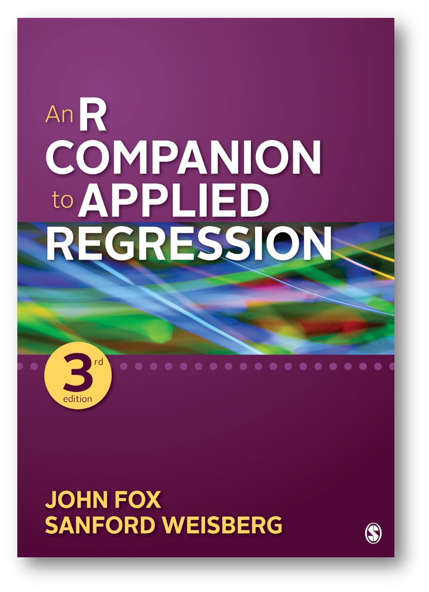
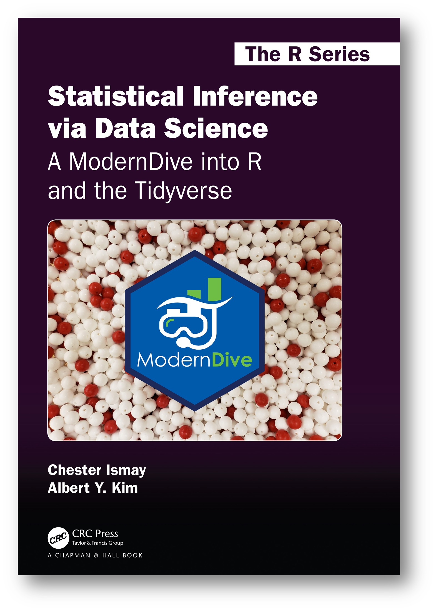

<style>
body {
  font-size: 17px;
  line-height: 1.6;
}
</style>


```{r setup, include=FALSE}
library(kernlab)
library(ggplot2)
library(dplyr)
```

## Welcome to POLI 706!

Welcome to POLI 706: Advanced Methods of Political Analysis!

In this introductory module, you’ll get an overview of what this course is about and what you can expect to learn. We’ll start by walking through the syllabus, outlining the key topics and structure of the course. Then, we’ll introduce some foundational concepts in statistical analysis as applied to political science—including statistical models, the difference between observation and experiment, and the idea of populations and samples.

## Syllabus

### Course Description

This course is for MAIS students seeking a deeper understanding of advanced methods in political analysis. It consists of 16 modules, ranging from foundational concepts in causal inference to advanced techniques such as generalized linear modeling, diagnostics, and prediction. The course is designed to bridge theoretical foundations with practical data analysis skills using R.

### Learning Outcomes

By the end of this course, students will be able to:

- Understand and critically evaluate different types of research designs in political science.
- Apply appropriate statistical models to analyze political and social data.
- Interpret regression results and conduct diagnostic tests to assess model fit.
- Implement advanced techniques such as generalized linear models, interaction terms, and bootstrapping in R.
- Effectively communicate statistical findings in written and visual forms suitable for academic and professional contexts.
- Develop greater confidence in using R for reproducible, data-driven political research.

### Required Materials

::: columns
::: {.column width="33%"}

```{r, echo=FALSE, fig.align='center', out.width='80%'}

```

:::
::: {.column width="33%"}

```{r, echo=FALSE, fig.align='center', out.width='80%'}

```

:::
::: {.column width="33%"}

```{r, echo=FALSE, fig.align='center', out.width='80%'}

```

:::
:::

This course requires regular access to a computer and is centered around programming in R. We will use three core texts throughout the semester.

**Fox (2016)** – *Applied Regression Analysis and Generalized Linear Models*  
  
- This book will help you build a strong conceptual and theoretical understanding of regression models and statistical inference. It’s especially useful for learning the underlying logic and assumptions behind the methods we use.

**R Companion (Fox & Weisberg, 2019)** – *An R Companion to Applied Regression*  

- This book complements the theoretical text by offering practical, hands-on guidance for implementing models in R.

**ModernDive (Ismay & Kim, 2024)** – *Statistical Inference via Data Science* <https://moderndive.com/>

- This book introduces statistical concepts through hands-on coding using the **tidyverse**, a modern collection of R packages. It walks you step-by-step through data visualization, wrangling, and modeling.

### Schedule

**Module 1: Introduction**  

- In this module, you’ll get an overview of the course structure. You’ll also be introduced to the role of statistical analysis in political science—how researchers use data to answer questions.

**Module 2: Review of Basics**  

- Refresh your understanding of basics. We’ll review how we measure concepts, along with core ideas like probability, distributions, and randomness—all crucial for making valid statistical inferences.

**Module 3: Causal Inference Fundamentals**  

- How do we know if X really causes Y? This module introduces you to the logic of causal thinking, the dangers of mistaking correlation for causation, and how researchers approach these challenges.

**Module 4: Randomization**  

- You’ll learn why assigning treatment randomly is so effective—and how it helps rule out alternative explanations.

**Module 5: Experiments vs. Observational Studies**  

- Not all studies can be experiments. Here, we compare experimental designs with observational data and discuss when observational studies can still give us good evidence about causality.

**Module 6: Ordinary Least Squares (OLS) I – Theory**  

- We dive into linear regression—the most widely used method in quantitative social science. You’ll learn how it works, what assumptions it relies on, and how to think about relationships between variables.

**Module 7: Ordinary Least Squares (OLS) II – Application**  

- This module focuses on using R to run OLS regressions, interpret results, and make sense of patterns in political or social datasets.

**Module 8: Ordinary Least Squares (OLS) III – Matrix Algebra**  

- Regression isn't just a button in R—there’s math behind it. This module gives you an introduction to the matrix algebra that powers regression models.

**Module 9: Generalized Linear Models (GLM) I**  

- What if your outcome is binary (yes/no) or a count (number of protests)? GLMs help us go beyond OLS. This week, you’ll learn the basics of how and when to use them.

**Module 10: GLMs II and Maximum Likelihood**  

- We build on the previous module by exploring how GLMs are estimated. You’ll be introduced to the concept of maximum likelihood and why it’s the backbone of modern statistical modeling.

**Module 11: Variable Types and Model Structure**  

- Not all variables are created equal. You’ll learn how different types of variables (like categories vs. numbers) shape your modeling choices and what it means to correctly specify a model.

**Module 12: Interactions and Marginal Effects**  

- Sometimes the effect of one variable depends on another. In this module, you’ll learn how to model and interpret interactions, and use marginal effects to tell a more accurate story with your data.

**Module 13: Non-Parametric Bootstrapping**  

- How can we estimate uncertainty when assumptions don’t hold? Bootstrapping offers a solution. You’ll practice resampling your data to build confidence intervals from scratch.

**Module 14: Parametric Bootstrapping and Prediction**  

- We take bootstrapping a step further. This module introduces parametric versions and shows how to simulate predictions from your models to evaluate how well they perform.

**Module 15: Diagnostics**  

- Just because you ran a model doesn’t mean it’s good. In this module, you’ll learn how to check whether your model fits the data well, spot common problems (like nonlinearity or influential outliers), and fix them.

**Module 16: Extensions and Wrap-Up**  

- In the final module, we reflect on what you’ve learned and look ahead to more advanced methods.


## Foundational concepts in statistical analysis

### Statistical Models

Social reality is complex, and individual life paths are shaped by countless contingent factors—family background, chance events, discrimination, institutional structures, and personal choices. In contrast, statistical models are simple by design. They don't aim to explain every detail of an individual’s outcome. Instead, they help us identify patterns and systematic relationships across a population—such as how income tends to vary with education or gender.

For example, imagine we want to understand the factors that influence income. In reality, a person’s income might be shaped by a wide range of factors: educational attainment, family wealth, gender, occupation, discrimination, geographic location, and even luck. A statistical model might simplify this by estimating the relationship between income and just a few of those variables, say education and gender. This model estimates how much each factor is associated with changes in income on average. However, even after accounting for these variables, we know the model won’t predict each person’s income perfectly—because life is much more complicated than any equation.

That’s where the **residual** comes in. The residual is the difference between the actual income of a person and the income predicted by the model. It represents everything that the model does **not** capture—random variation, unmeasured influences, personal experiences, or simply the limits of our data. In essence:

> **Observed income = Predicted income (systematic part) + Residual (unexplained part)**

Residuals remind us that models are just **descriptive tools**, not literal explanations of reality. As George Box famously said, *“All models are wrong, but some are useful.”* The goal is not to build a model that explains everything, but one that helps us summarize important relationships in the data, guided by theory and grounded in evidence.

Although statistical models are very simple compared to social reality, they often make **strong assumptions** about the structure of the data. These assumptions are not always rooted in the social theories or questions that motivated the research in the first place—and are frequently wrong. 

```{r, echo=FALSE, warning=FALSE, fig.cap= "Relationship between Age and Income", fig.align='center'}
# Load data and sample
data(income)
set.seed(123)
income_sample <- income %>%
  slice_sample(n = 500) %>%
  mutate(
    age_num = as.numeric(AGE),
    income_num = as.numeric(INCOME)
  )

age_levels <- levels(income$AGE)
income_levels <- levels(income$INCOME)

# Plot using the numeric versions
ggplot(income_sample, aes(x = age_num, y = income_num)) +
  geom_jitter(width = 0.2, height = 0.2, alpha = 0.6) +
  geom_smooth(method = "lm", formula = y ~ x, se = FALSE, color = "skyblue") +
  labs(x = "\nAge\n", y = "Income (in $)\n",
       title = "") +
  scale_x_continuous(breaks = 1:length(age_levels), labels = age_levels) +
  scale_y_continuous(breaks = 1:length(income_levels), labels = income_levels) +
  theme_linedraw()

```


Consider the relationship between age and income. It may seem reasonable to believe that income increases with age—after all, people gain experience and tend to earn more as they progress through their careers. However, assuming that this relationship is **linear** implies that each additional year of age contributes the same increase in income, regardless of whether someone is 25 or 55. This is rarely the case.

In the figure above, age and income are plotted, with a fitted linear regression line shown in blue. While the line indicates a general upward trend, the spread of the data points suggests that the increase in income is not uniform across age groups. Income appears to rise quickly in early adulthood and may taper off in older age groups. These patterns highlight the limitations of assuming a strictly linear relationship.

This example highlights a broader point: while linear models can be convenient, they often oversimplify the data and obscure important patterns. So while assuming linearity simplifies the math and interpretation, it may misrepresent the true relationship. A statistical model is of no practical use if it is an inaccurate description of the data, and we will, therefore, pay close attention to the descriptive accuracy of statistical models. 

### Observation and Experiment

In social science and statistical research, it is crucial to distinguish between observational data and experimental data, as they have different implications for how confidently we can make causal claims.

Experimental data come from studies where the researcher actively manipulates one or more variables. In a well-designed experiment—especially a randomized experiment—participants or units are randomly assigned to different conditions. This randomization ensures that any differences observed between groups can be attributed to the treatment or intervention, rather than to pre-existing differences. For example, in a clinical drug trial, patients might be randomly assigned to receive either a new drug or a placebo. Because the assignment is random, any difference in outcomes (like recovery rates) can be more confidently attributed to the drug itself.

In contrast, observational data are collected without manipulating any variables. Researchers simply observe and record the values of both the explanatory variable (the "cause") and the outcome variable (the "effect") as they occur naturally. For example, a study might compare the incomes of men and women based on survey data. However, since the researcher did not control who is male or female (nor can they), and other factors like job type or work experience might differ systematically between the groups, it becomes harder to isolate the effect of gender alone on income.

The power of randomized experiments lies in the principle of random assignment. When subjects are randomly assigned to different conditions, we can be confident that any systematic differences across groups are due to chance rather than hidden biases or pre-existing conditions. In other words, randomization helps eliminate confounding variables, allowing us to isolate the effect of the variable we're interested in.

However, even with randomized experiments, drawing completely unambiguous causal conclusions can be more complicated than it seems. While we may be able to attribute an outcome difference to an experimental manipulation, we cannot always be sure that the manipulation perfectly represents the explanatory variable we care about. For instance, imagine a randomized drug trial where some patients receive a new medication and others receive a placebo. Suppose we find that patients who received the drug improved more, on average. Can we say for certain that the drug’s active ingredient caused the improvement? Not entirely. It’s possible that the researchers’ enthusiasm was unconsciously conveyed to the patients, or that the drug’s bitter taste made patients believe more strongly in its effectiveness, influencing their response.

To address these alternative explanations, researchers employ rigorous practices, where neither the experimenter nor the subject knows who receives the real drug or the placebo. Additionally, they control for external factors like the color or shape of the pills. Still, no experiment can guarantee that all potentially confounding factors are neutralized. Although randomized experiments give us a stronger basis for causal claims than observational studies do, the distinction is not absolute.

This becomes especially evident when we turn to observational data. For example, consider a dataset on occupations that includes measures of educational level, income, and occupational prestige. Suppose we observe that jobs requiring more education tend to be more prestigious, and that higher-income jobs are also viewed as more prestigious. We might also notice that education and income themselves are strongly correlated. What happens when we statistically control for one of these variables? If we control for education, the correlation between income and prestige decreases. Similarly, controlling for income weakens the link between education and prestige. Yet in both cases, the relationship does not disappear entirely.

To make sense of these patterns, it helps to sketch a simple causal model. We might hypothesize that education influences both income and prestige, and that income, in turn, influences prestige. From this perspective, part of the observed relationship between prestige and income is spurious—that is, not a direct causal connection but a byproduct of both being influenced by education. Controlling for education allows us to remove that spurious component. Conversely, the relationship between education and prestige is partly mediated by income. In other words, education affects income, which then affects prestige. When we control for income, we reveal that some of the influence of education on prestige flows indirectly through income.

### Populations and Samples

In statistical and social science research, it is important to distinguish between populations and samples. A population refers to the entire group of individuals or units a researcher is interested in studying, while a sample is a subset of that population from which data are actually collected. Random sampling is a method in which each member of the population has an equal chance of being selected for the sample. This approach allows researchers to make more reliable inferences about the whole population based on the characteristics of the sample.

Statistical inference is often introduced in the context of random sampling from a clearly defined population, which provides clarity and interpretability. However, in practice, statistical inference is applied much more broadly. Even in randomized experiments, where inference technically applies to the hypothetical population of all possible random assignments, researchers are usually interested in generalizing findings to a broader, often vaguely defined population. Similarly, even when random sampling from a real population occurs, the aim is often to extend conclusions beyond that immediate group.

There are also cases where data are collected from the entire population, yet inference remains meaningful because the focus is on understanding underlying processes, not merely describing the observed units. This makes inference valid even without traditional sampling.

In many situations, data are collected in a haphazard or non-random manner. While this limits our ability to make broad generalizations, it does not make statistical inference useless. Researchers must be cautious, ensuring that their sample does not differ meaningfully from the population of interest or statistically controlling for relevant variables.

