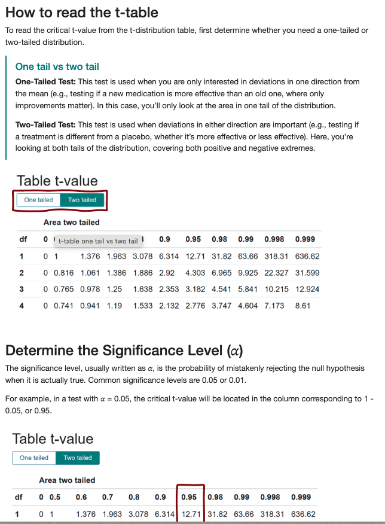
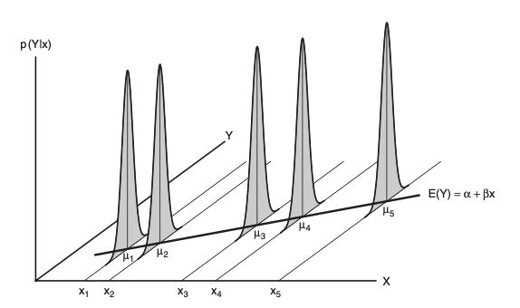

```{=html}
<style>
body {
  font-size: 17px;
  line-height: 1.6;
}
</style>
```

```{r setup, include=FALSE}
library(kernlab)
library(showtext)
library(kableExtra)
library(dplyr)
library(tidyverse)
library(scales)
library(tidyverse)
```


In the last module, we explored the basic concepts of Ordinary Least Squares (OLS) regression. We focused on understanding what OLS regression is, how to interpret the regression equation, and how to evaluate the model’s fit using residuals and R-squared value.

In this module, we move beyond model construction and turn to interpreting and evaluating regression results. We will cover hypothesis testing and confidence intervals, and the key assumptions that must hold for OLS results to be valid. we begin by learning how to use regression models to test hypotheses and construct confidence intervals. Next, we turn to the task of interpreting regression output. This includes understanding the meaning of coefficients, standard errors, and p-values. Finally, we examine the key assumptions that underpin OLS regression. This includes assumptions about the behavior of residuals as well as assumptions about the independent variables.

By the end of this module, you’ll be able to interpret regression results more confidently and assess whether your findings are both statistically valid and substantively meaningful.

## Part 1: Confidence Intervals and Hypothesis Tests

In this part, we focus on two fundamental concepts in statistical inference for regression: **hypothesis testing** and **confidence intervals**. We begin by understanding the **sampling variance** and **standard errors** of regression coefficients—these help us quantify how much uncertainty surrounds our estimates. From there, we move on to test hypotheses and construct confidence intervals that give us a plausible range for the true population values.

### Sampling Variance and Standard Errors of Coefficients

Let’s revisit the basic regression equation:

$$
Y_i = A + B X_i + E_i
$$

This is the equation for a **sample** simple linear regression.

- $Y_i$ is the **dependent variable** (the outcome we want to explain),  
- $X_i$ is the **independent variable** (the predictor),  
- $A$ is the **intercept**, representing the predicted value of $Y$ when $X = 0$,  
- $B$ is the **slope coefficient**, showing the average change in $Y$ for a one-unit increase in $X$,  
- $E_i$ is the **error term**, capturing deviations due to randomness or unmeasured factors.

We also learned how to calculate **residual variance** and **residual standard error (RSE)**:

$$
S^2_E = \frac{\sum E^2_i}{n - 2}
$$

$$
S_E = \sqrt{\frac{\sum E^2_i}{n - 2}}
$$

While residual variance and RSE tell us how well our model fits the data, the sampling variance and standard errors of coefficients help us understand how precise our estimates are.

The **sampling variance** of the slope coefficient $B$ is:

$$
\hat{V}(B) = \frac{S^2_E}{\sum(x_i - \bar{x})^2}
$$

- $S^2_E$ measures how much actual data points deviate from the regression line.  

- $\sum(x_i - \bar{x})^2$ measures how spread out the $X$ values are.  

The **standard error** of the slope coefficient is the square root of the sampling variance:

$$
SE(B) = \sqrt{ \frac{S^2_E}{\sum(x_i - \bar{x})^2} }
$$

- This tells us how much the slope estimate might vary across different samples.  

- More spread in $X$ and smaller residual variance lead to more precise (smaller) standard error.

For the **intercept**, the sampling variance is:

$$
\hat{V}(A) = \frac{S^2_E \sum x_i^2}{n \sum(x_i - \bar{x})^2}
$$

- A **larger residual variance** increases uncertainty in the intercept.  

- If $X$ values are **tightly clustered**, it becomes harder to estimate the intercept precisely.  

- A **larger sample size** ($n$) improves precision by reducing the sampling variance.

The **standard error** of the intercept is:

$$
SE(A) = S_E \cdot \sqrt{ \frac{1}{n - 2} + \frac{\bar{x}^2}{\sum(x_i - \bar{x})^2} }
$$


### Hypothesis Testing and Confidence Intervals

When we run a regression, we get an estimate of the slope ($B$). But we know that this estimate may vary from sample to sample. The true slope in the population is called $\beta$, and we want to understand how close $B$ is to $\beta$.

A **confidence interval** gives us a range where we think the true slope ($\beta$) might be. It’s based on our estimate from the data ($B$), and it accounts for how much uncertainty (or error) there is in that estimate. To construct a 100(1 - $a$) % confidence interval for the slope, we take

$$
\beta = B \pm t_{\alpha/2} \cdot SE(B)
$$

- $SE(B)$ is the standard error of the slope estimate.  

- $t_{\alpha/2}$ is a critical value of $t$ with n-2 degrees of freedom and a probability of $a/2$ to the right.

To learn more about the t-distribution, see: <https://datatab.net/tutorial/t-distribution/>

```{r, echo=FALSE, fig.align='center', out.width='80%'}

```

To test whether a predictor really matters, we often test the null hypothesis ($H_0$), which indicates that the true slope $\beta = 0$

$H_0 : \beta = 0$

$$
t_0 = \frac{B-\beta_0}{SE(B)}
$$

This helps us determine whether the observed effect is statistically significant or could have occurred by random chance.

Let’s try this with our V-Dem dataset:

```{r}
vdem <- read.csv("vdem.csv") %>% drop_na()

# Filter V-Dem data to year 2000
vdem_2000 <- vdem %>%
  filter(year == 2000)

# Fit the linear model
model <- lm(v2x_polyarchy ~ v2elembaut, data = vdem_2000)

# Find predicted y value (y hat) for each unit i, and calculate residuals based on the y hat value
vdem_2000 <- vdem_2000 %>%
  mutate(y_hat = predict(model), 
         residual = v2x_polyarchy - y_hat)

# Number of observations
n <- nrow(vdem_2000)

# Residual Variance
rv <- sum(vdem_2000$residual^2) / (n - 2)

# Mean of the independent variable
x_bar <- mean(vdem_2000$v2elembaut)

# Sum of squared deviations from the mean
ssx <- sum((vdem_2000$v2elembaut - x_bar)^2)

# The standard error of the slope coefficient
se_b <- sqrt(rv / ssx)
se_b
```

```{r}
# The slope coefficient B
coef_B <- coef(model)[2]
coef_B
```


Since the t score for 95% confidence interval $t_{.025} \approx 2$, unless $n$ is very small, the 95% confidence interval for the population slope $\beta$ is:

```{r}
coef_B + 2 * se_b
coef_B - 2 * se_b
```

This means:

Based on your sample data, you estimate that each 1 point increase in EMB autonomy (v2elembaut) is associated with an increase of about 0.139 points in the Electoral Democracy Index (v2x_polyarchy). But, because this is based on a sample, there's some uncertainty. The true value of this relationship in the full population is likely to be somewhere between 0.1289 and 0.1496, with about 95% confidence.

## Part 2: Interpret the Regression Results

In the last module and Part 1, we've learned how to estimate a regression model, assess model fit, and conduct inference using confidence intervals and hypothesis tests. Now, we are ready to interpret the regression output and understand what the numbers in the regression table actually mean for our research question.

```{r}
model <- lm(v2x_polyarchy ~ v2elembaut, data = vdem_2000)
summary(model)
```

#### Call

This shows the command used to fit the model. In this case:

lm(formula = v2x_polyarchy ~ v2elembaut, data = vdem_2000)

It tells us that a linear regression was performed to predict `v2x_polyarchy` using `v2elembaut`.

#### Residuals

```{mathematica}
Min       1Q   Median       3Q      Max
-0.218  -0.073   0.006     0.068    0.208
```

These five values summarize the distribution of the residuals — the differences between the actual values and the values predicted by the model.

- Min and Max: the smallest and largest residuals.

- 1Q (first quartile) and 3Q (third quartile): show the range where the middle 50% of residuals fall.

- Median: the middle residual, close to 0, which is what we expect in a well-behaved model.

#### Estimate

These are the coefficients of the regression model:

- `Intercept` (0.439259): the predicted value of v2x_polyarchy when v2elembaut is 0.

- `v2elembaut` (0.139253): for each one-unit increase in EMB autonomy, the model predicts an increase of 0.139 in electoral democracy index.

#### Std. Error

These values measure the precision of each estimate. A smaller standard error indicates a more precise estimate. We can confirm that the standard error for the slope coefficient matches the value we manually calculated above (`se_b`).

#### t value

The t-value indicates the statistical significance of each independent variable in predicting the dependent variable. It measures how many standard errors away from zero the estimated coefficient for a variable is. A higher t-value, either positive or negative, suggests a stronger relationship between the independent variable and the dependent variable. 

#### Pr(>|t|)

This is the p-value for each coefficient:

- A very small p-value (usually less than 0.05) means that the coefficient is statistically significant.

- In our case, both p-values are < 2e-16, so we reject the null hypothesis that these coefficients are 0. In other words, EMB autonomy has a statistically significant effect on electoral democracy.

#### Residual standard error

This is the average size of prediction errors. It tells us that on average, the model’s predicted values are about 0.097 units away from the actual values of v2x_polyarchy.

The degrees of freedom (129) equal the number of observations minus the number of parameters estimated (n - 2).

#### Multiple R-squared and	Adjusted R-squared:

Multiple R-squared tells us that 84.9% of the variation in the dependent variable is explained by the model.

Adjusted R-squared is a version of R-squared that adjusts for the number of predictors in the model. It’s useful when comparing models with different numbers of variables.

#### F-statistic and p-value: < 2.2e-16

F-statistic is a measure of the overall significance of the regression model. It tests the null hypothesis that all of the coefficients in the regression model are equal to zero. A high F-statistic and low p-value suggest that the model is statistically significant

## Part 3: Key assumptions 

The key assumptions of the simple regression model concern the behavior of the errors or of the distribution of Y conditional on X

### 1. Linearity

We assume that the relationship between X and Y is linear. In other words, the average error for any given value of X is zero:

$$
E(\epsilon|X) = 0
$$

This means that, on average, the regression line correctly predicts Y. Another way to say this is that the expected value of Y depends linearly on X. If the true relationship is nonlinear, then a linear regression line might not describe the data well.

### 2. Constant variance

The variance of the errors should be the same across all values of X. That is: $X: V(\epsilon|x_i) = \sigma^2_\epsilon$. This assumption ensures that the spread of Y values around the regression line is consistent. If the variance changes with X, then our model’s predictions may be unreliable, especially in parts of the data where the variance is larger.

### 3. Normality

The errors should follow a normal distribution. That means when we plot the errors, they should form a bell-shaped curve. This is especially important for hypothesis testing and confidence intervals, as many statistical tests rely on the normality assumption to be valid. Equivalently, we can say that the distribution of Y, given any value of X, is normally distributed.

The assumptions of linearity, constant variance, and normality are illustrated in the figure.

```{r, echo=FALSE, fig.align='center', out.width='80%'}

```

- The black regression line shows the expected value of the dependent variable Y for each value of the independent variable X. This is the best-fitting straight line through the data, assuming a linear relationship between X and Y.

- At each point $x_1, x_2,x_3,x_4, x_5$, you see a bell-shaped curve standing up vertically. These represent the conditional distributions of Y given X — in other words, how the values of Y are distributed when X takes a specific value. The bell shape indicates that each conditional distribution of Y is normally distributed.

- The height and spread of each bell curve are identical, showing that the variance of Y is constant across all values of X - this is the constant variance assumption.

### 4. Independence

Each observation in the data should be independent of the others. This means that the error for one observation should not be related to the error for another. 

$$
Cov(\epsilon_i, \epsilon_j) = 0,  \text{     for i} \neq {j}
$$

This assumption is usually valid if the data come from a simple random sample. However, in time-series or panel data, observations may be correlated over time or across units, which would violate this assumption.

### 5. Fixed X , or X measured without error and independent of the error

Depending on the design of a study, the values of the explanatory variable may be fixed in advance of data collection or they may be sampled along with the response variable. Fixed X corresponds almost exclusively to experimental research, in which the value of the explanatory variable is under the direct control of the researcher; if the experiment were replicated, then—at least in principle—the values of X (i.e., the xis) would remain the same.

### 6. X is not invariant

There must be some variation in the independent variable X. If all values of X are the same, we cannot ift a regression line - it would be impossible to estimate a relationship without any differences in the predictor. 

## Wrapping Up: What We’ve Learned

In this module, we extended our understanding of OLS regression by moving from model construction to statistical inference. We began by learning how to quantify uncertainty in our regression estimates using **standard errors**, which measure how much our coefficient estimates would vary across repeated samples.

We then explored two core tools of statistical inference: **confidence intervals** and **hypothesis testing**. Confidence intervals gave us a plausible range of values for the true population parameters.

Next, we turned to interpreting regression output. We examined what each element of the regression table means, from coefficients and standard errors to t-values and p-values.

Finally, we reviewed the **key assumptions** that must hold for OLS regression results to be valid. These assumptions are important because they ensure that the conclusions we draw from the regression model are both **statistically reliable** and **meaningful**.

By mastering these concepts, you are now equipped not only to run linear regression models but also to evaluate their quality and make informed judgments about what your results actually mean. 
Next, you will have the opportunity to reinforce these concepts through a quiz and **Problem Set 5**. Make sure to complete them before moving on to the next module, where we will cover multiple regression and learn how to run a regression model in R.
